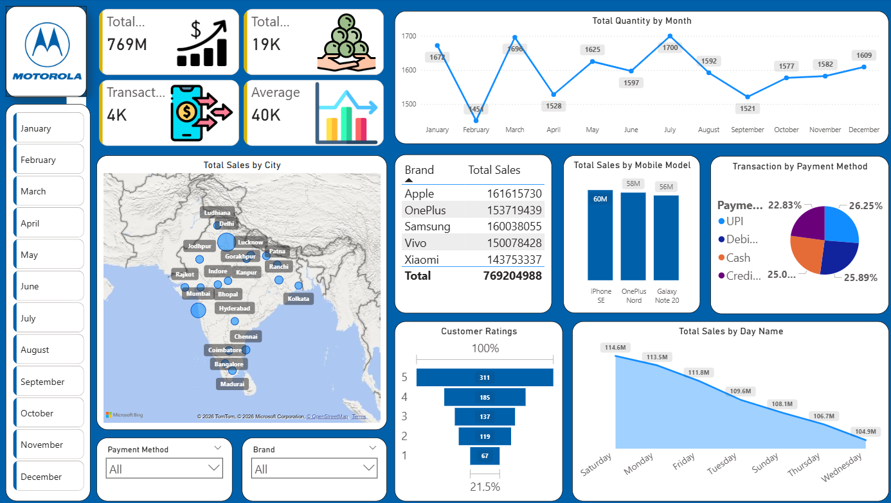

# 📊 Mobile Sales Analysis Dashboard (Power BI)

This project showcases an **interactive Power BI dashboard** built to analyze mobile phone sales performance across brands, cities, months, payment methods, and customer ratings.

---

## 📌 Project Overview

The objective of this project is to analyze mobile sales data and provide **actionable business insights** through interactive visualizations.  
The dashboard helps decision-makers understand sales trends, customer behavior, and brand performance at a glance.

---

## 🛠️ Tech Stack

- **Tool:** Power BI  
- **Data Transformation:** Power Query  
- **Analytics & Measures:** DAX  
- **Visualizations:** KPI Cards, Line Charts, Bar Charts, Pie Charts, Map, Slicers

---

## 📊 Key KPIs

- **Total Sales:** 769M  
- **Total Quantity Sold:** 19K  
- **Total Transactions:** 4K  
- **Average Sales Value:** 40K  

---

## 📈 Dashboard Insights

### 🔹 Monthly Sales Trend
- Sales fluctuate throughout the year
- Highest quantity sold in **March and July**
- Seasonal patterns clearly visible

### 🔹 Brand Performance
- Brands analyzed: **Apple, Samsung, OnePlus, Vivo, Xiaomi**
- Apple and Samsung are top revenue contributors

### 🔹 Mobile Model Performance
- Best-performing models:
  - iPhone SE
  - OnePlus Nord
  - Galaxy Note 20

### 🔹 City-wise Sales Analysis
- Map visualization highlights sales across major Indian cities
- Helps identify high-performing regions

### 🔹 Payment Method Analysis
- Payment methods include:
  - UPI
  - Debit Card
  - Credit Card
  - Cash
- Digital payments dominate overall transactions

### 🔹 Customer Ratings
- Majority ratings fall under **4★ and 5★**
- Indicates strong customer satisfaction

### 🔹 Day-wise Sales Trend
- Highest sales recorded on **Saturday**
- Lower sales during mid-week

---

## 🎛️ Interactive Features

- Month slicer (January–December)
- Brand filter
- Payment method filter
- Dynamic visuals responding to user selections

---

## 📂 Project Structure

---

## ▶️ How to Use

1. Download the `.pbix` file  
2. Open it in **Power BI Desktop**  
3. Use slicers and filters to explore insights interactively  

---

## 🎯 Learning Outcomes

- Built a complete **business-ready Power BI dashboard**
- Applied **DAX for KPI calculations**
- Improved **data storytelling & visualization skills**
- Gained hands-on experience with **sales analytics**

---

## 🚀 Future Enhancements

- Add Month-over-Month & Year-over-Year growth
- Include profit and cost analysis
- Drill-through pages for brand & city-level insights
- Publish dashboard to Power BI Service

---

## 📬 Contact

**Name:** Satyam Kumar  
**GitHub:** https://github.com/satyam0525  
**LinkedIn:** https://www.linkedin.com/in/satyam-kumar-978895327/  

---

⭐ If you like this project, don’t forget to **star the repository**!
